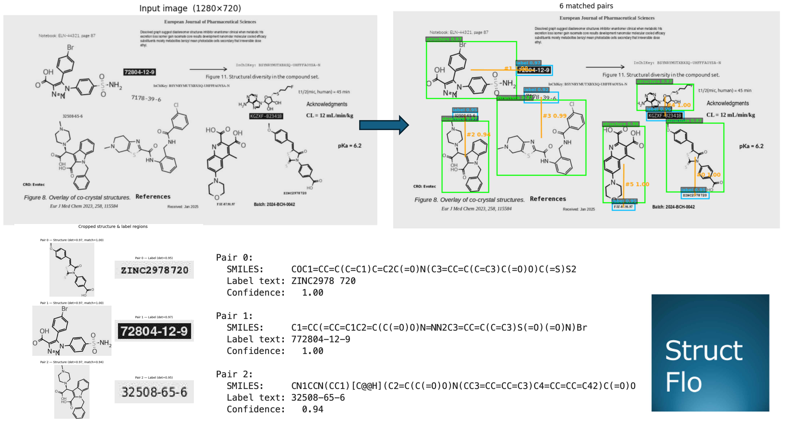
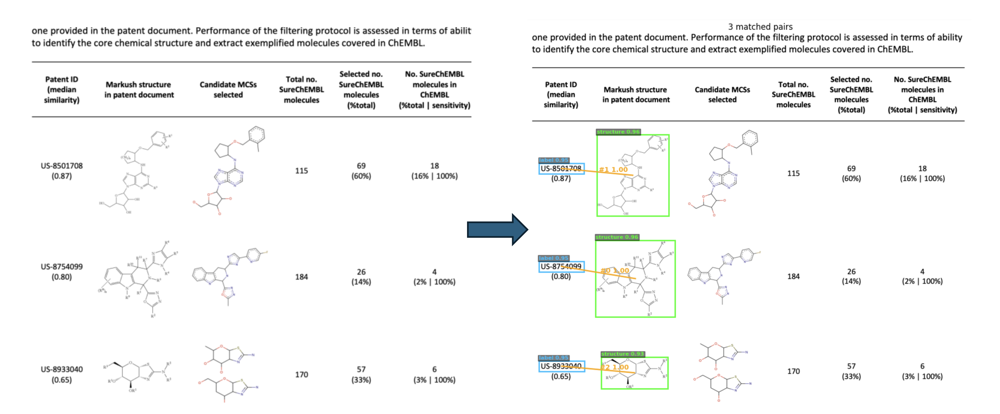

<h1 align="center">structflo.cser</h1>

<p align="center">
  
</p>

<p align="center">
  <a href="https://pepy.tech/projects/structflo-cser"></a>
  <a href="https://github.com/structflo/structflo-cser/actions"></a>
  <a href="https://github.com/structflo/structflo-cser/blob/main/LICENSE"></a>
  <a href="https://www.linkedin.com/in/sidxz/"></a>
  <a href="https://github.com/sidxz/"></a>
</p>

<p align="center">
  Chemical structure and label extraction from scientific documents.
</p>

<p align="center">
  <a href="#installation">Installation</a> &bull;
  <a href="#quick-start">Quick Start</a> &bull;
  <a href="#step-by-step-pipeline">Step-by-Step</a> &bull;
  <a href="#matchers">Matchers</a> &bull;
  <a href="#downstream-processing">Downstream Processing</a> &bull;
  <a href="#notebooks">Notebooks</a>
</p>

---

**structflo.cser** extracts chemical structure–label pairs from images and PDF pages. It uses a fine-tuned YOLO detector trained on synthetic chemical structure data to locate structures and compound labels on a page, then pairs them using Learned Pair Scorer (LPS) model or a simpler Hungarian Matcher.

The extracted crops can be passed to any structure-to-SMILES converter (DECIMER, MolScribe) and any OCR engine for label text. DECIMER and EasyOCR are bundled for convenience, but any downstream tools can be swapped in.

**Two-step process:**

1. **Detect** — A fine-tuned YOLO detector finds all chemical structures and compound labels in the image
2. **Match** — A matcher pairs each structure with its corresponding label, producing cropped image pairs

|                   | `LearnedMatcher` (default)              | `HungarianMatcher`              |
| ----------------- | --------------------------------------- | ------------------------------- |
| Approach          | Neural Pair Scorer (LPS)                | Geometric (centroid distance)   |
| Setup             | Auto-downloads weights                  | Zero config                     |
| Speed             | Fast (GPU accelerated)                  | Instantaneous                   |
| Accuracy          | Better for complex or crowded pages     | Good for simple layouts         |
| Output            | `CompoundPair`                          | `CompoundPair` (identical)      |

## Installation

```bash
pip install structflo-cser
```

```bash
# or with uv
uv add structflo-cser
```

This also installs DECIMER and EasyOCR for downstream SMILES and text extraction. The core pipeline does not depend on them — any extractor implementation can be swapped in.

## Quick Start

One call from image to `(SMILES, label)` pairs:

```python
from structflo.cser.pipeline import ChemPipeline
from structflo.cser.lps import LearnedMatcher

pipeline = ChemPipeline(matcher=LearnedMatcher())
results = pipeline.process("page.png")

for pair in results:
    print(pair.smiles, pair.label_text)
```

Weights for both the detector and the LPS are auto-downloaded from HuggingFace Hub on first use.

Export to a pandas DataFrame or JSON:

```python
df   = ChemPipeline.to_dataframe(results)
data = ChemPipeline.to_json(results)
```

```
   match_distance  match_confidence                              smiles     label_text
0          135.19            0.9844  CN1CCC2=C(C1)SC(=N2)C(=O)NC3=...      7178-39-6
1          208.40            0.9973  C1=CC(=CC=C1C2=C(C(=O)O)N=NN2...     72804-12-9
2          126.25            0.9997  COC1=CC=C(C=C1)C=C2C(=O)N(C3=...   ZINC2978 720
```

### PDF input

For PDFs, use `process_pdf()` — it renders each page and returns one result list per page:

```python
from structflo.cser.pipeline import ChemPipeline
from structflo.cser.lps import LearnedMatcher

pipeline = ChemPipeline(matcher=LearnedMatcher())

# Returns list[list[CompoundPair]] — one inner list per page
all_pages = pipeline.process_pdf("paper.pdf")

for page_num, pairs in enumerate(all_pages):
    print(f"Page {page_num + 1}: {len(pairs)} compound pairs")
    for pair in pairs:
        print(f"  {pair.label_text:20s}  {pair.smiles}")
```

Pass `output_pdf` to save an annotated copy with bounding boxes and extracted data overlaid:

```python
pipeline.process_pdf("paper.pdf", output_pdf="paper_annotated.pdf")
```

## Step-by-Step Pipeline

For finer control, each stage is exposed individually.

### 1. Create the pipeline

```python
from structflo.cser.pipeline import ChemPipeline

# Default: LearnedMatcher — auto-downloads LPS weights on first use
pipeline = ChemPipeline(tile=False, conf=0.70)
```

For a heuristic based approach, use `HungarianMatcher`:

```python
from structflo.cser.pipeline import ChemPipeline, HungarianMatcher

pipeline = ChemPipeline(
    tile=False,
    conf=0.70,
    matcher=HungarianMatcher(max_distance=500),
)
```

The pipeline is lazy — detector weights, DECIMER, and EasyOCR are loaded on first use only.

### 2. Detect

```python
detections = pipeline.detect("page.png")

n_struct = sum(1 for d in detections if d.class_id == 0)
n_label  = sum(1 for d in detections if d.class_id == 1)
print(f"Found {n_struct} structures and {n_label} labels")
# Found 6 structures and 6 labels
```

`class_id=0` = chemical structure &nbsp;|&nbsp; `class_id=1` = compound label

### 3. Match

```python
pairs = pipeline.match(detections)
# Matched 6 structure–label pairs
#   Pair 0: distance=135px  structure@(490,421)  label@(489,285)
#   Pair 1: distance=208px  structure@(258,194)  label@(466,195)
```

### 4. Visualise

```python
from structflo.cser.viz import plot_detections, plot_pairs, plot_crops, plot_results

fig = plot_detections(img, detections)   # green = structure, blue = label
fig = plot_pairs(img, pairs)             # orange lines connect matched pairs
fig = plot_crops(img, pairs)             # cropped structure and label regions
fig = plot_results(img, results)         # final annotated output
```



### 5. Enrich — SMILES and label text

```python
enriched = pipeline.enrich(pairs, "page.png")

for i, p in enumerate(enriched):
    print(f"Pair {i}:")
    print(f"  SMILES:     {p.smiles}")
    print(f"  Label text: {p.label_text}")
```

```
Pair 0:
  SMILES:     CN1CCC2=C(C1)SC(=N2)C(=O)NC3=C(C=CC=C3)CNC(=O)C4=CC=CC(=C4)Cl
  Label text: 7178-39-6

Pair 1:
  SMILES:     C1=CC(=CC=C1C2=C(C(=O)O)N=NN2C3=CC=C(C=C3)S(=O)(=O)N)Br
  Label text: 72804-12-9
```

## Matchers

### Learned Pair Scorer — `LearnedMatcher` (default)

A neural matcher trained to score structure–label compatibility using both visual crops and geometric features. It replaces the raw distance cost matrix with a learned association probability, then solves global assignment with the Hungarian algorithm.

Weights are auto-downloaded from HuggingFace Hub on first use — no manual setup needed. Models are hosted at:

- Detector: [huggingface.co/sidxz/structflo-cser-detector](https://huggingface.co/sidxz/structflo-cser-detector)
- LPS scorer: [huggingface.co/sidxz/structflo-cser-lps](https://huggingface.co/sidxz/structflo-cser-lps)

```python
from structflo.cser.pipeline import ChemPipeline
from structflo.cser.lps import LearnedMatcher

pipeline = ChemPipeline(
    matcher=LearnedMatcher(
        min_score=0.5,      # drop pairs below this confidence
        max_dist_px=None,   # optional centroid pre-filter to save compute
    )
)
```

`min_score` — pairs scoring below this threshold are discarded as unlabelled structures.

### Hungarian Matcher — `HungarianMatcher` (fallback)

Pairs structures and labels by minimising total centroid-to-centroid distance. Zero config, zero weights download. Useful for simple document layouts or as a fast sanity check.

```python
from structflo.cser.pipeline import ChemPipeline, HungarianMatcher

pipeline = ChemPipeline(
    matcher=HungarianMatcher(max_distance=500),
)
```

`max_distance` — maximum pixel distance for a valid pair. Increase for large pages; reduce to avoid false pairings on dense layouts.

## Downstream Processing

**structflo.cser** outputs cropped image pairs. Plug in any converter for SMILES and any OCR for label text.

### SMILES extraction

DECIMER is bundled by default. Swap for MolScribe or any custom `BaseSmilesExtractor`:

```python
from structflo.cser.pipeline.smiles_extractor import BaseSmilesExtractor

class MyExtractor(BaseSmilesExtractor):
    def extract(self, image) -> str:
        return my_model.predict(image)

pipeline = ChemPipeline(smiles_extractor=MyExtractor())
```

### OCR

EasyOCR is bundled by default. Swap for any custom `BaseOCR`:

```python
from structflo.cser.pipeline.ocr import BaseOCR

class MyOCR(BaseOCR):
    def extract(self, image) -> str:
        return my_ocr.read(image)

pipeline = ChemPipeline(ocr=MyOCR())
```

## CLI

Run extraction directly from the terminal:

```bash
# Detect and pair structures/labels in a directory of images
sf-detect --image_dir data/test_images/ --conf 0.60 --no_tile --pair --max_dist 500

# Full pipeline: detect → match → SMILES + OCR
sf-extract page.png
```

All available commands:

| Command                   | Description                                |
| ------------------------- | ------------------------------------------ |
| `sf-detect`               | Run YOLO detection on images               |
| `sf-extract`              | Full pipeline: detect → match → extract    |
| `sf-generate`             | Generate synthetic training data           |
| `sf-train`                | Train the YOLO detection model             |
| `sf-train-lps`            | Train the Learned Pair Scorer              |
| `sf-eval-lps`             | Evaluate LPS on a test set                |
| `sf-fetch-smiles`         | Download SMILES from ChEMBL               |
| `sf-download-distractors` | Download distractor images for generation  |
| `sf-annotate`             | Launch the web annotation server           |

## Notebooks

| Notebook | Description |
| -------- | ----------- |
| [01-quickstart.ipynb](notebooks/01-quickstart.ipynb) | Step-by-step pipeline walkthrough: detect → match → enrich, then one-call convenience API |
| [02-LPS.ipynb](notebooks/02-LPS.ipynb) | Using the Learned Pair Scorer for improved matching on complex document pages |

## License

Apache License 2.0
